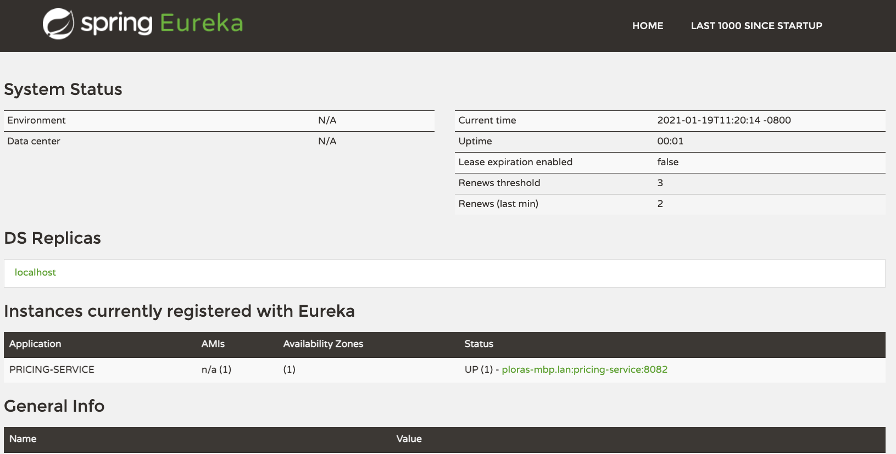

# Pricing Service

The Pricing Service is a REST WebService that simulates a backend that
would store and retrieve the price of a vehicle given a vehicle id as
input. In this project, you will convert it to a microservice.

**Spring Data REST** makes it easy to expose microservices. **Spring Data REST** builds on top of Spring Data repositories and automatically exports those as REST resources. No need Service or Controller (@RestController, @RequestMapping) layer!

So how does **Spring Data Rest** work?
1. At application startup, Spring Data Rest finds all of the spring data repositories
2. Then, Spring Data Rest creates an endpoint that matches the entity name
3. Next, Spring Data Rest appends an S to the entity name in the endpoint
4. Lastly, Spring Data Rest exposes CRUD (Create, Read, Update, and Delete) operations as RESTful APIs over HTTP

**Pricing Service:** http://localhost:8082/services/price?vehicleId=1

Example JSON response: 
```
{
  "vehicleId": 1,
  "currency": "USD",
  "price": 20594.43
}
```

## Features

- REST WebService integrated with Spring Boot using **Spring Data REST**
- **Service** and **Controller** layers are **optional**. 

## Instructions on making a microservice for Pricing Service: 
1. Start with a new project by navigating to [Spring Initalizr](start.spring.io)
2. Add the required dependencies
3. Annotate in main Spring application class with ```@EnableEurekaClient```. This annotation is optional if ```spring-cloud-starter-netflix-eureka-client``` dependencyy is on the classpath. 

#### Depenedencies: 
- Rest Repositories (for ```spring-boot-starter-data-rest```)
- Cloud Config
- Eureka Discovery Client (for ```spring-cloud-starter-netflix-eureka-client```)
- H2 Databse 
- Spring Web
- Spring Data JPA (to persist data in SQL stores with Java Persistence API using Spring Data and Hibernate)

## How to turn this microservice into a Eureka Client: 

1. Ensure that both ```Eureka Discovery Client``` and ```Cloud Config``` dependencies are included: 
```
   <dependency>
        <groupId>org.springframework.cloud</groupId>
        <artifactId>spring-cloud-starter-netflix-eureka-client</artifactId>
    </dependency>
    <dependency>
        <groupId>org.springframework.cloud</groupId>
        <artifactId>spring-cloud-starter-config</artifactId>
    </dependency>
```

2. Add this dependency to dependency management: 
```
    <dependencyManagement>
        <dependencies>
            <dependency>
                <groupId>org.springframework.cloud</groupId>
                <artifactId>spring-cloud-starter-parent</artifactId>
                <version>Greenwich.RELEASE</version>
                <type>pom</type>
                <scope>import</scope>
            </dependency>
        </dependencies>
    </dependencyManagement>
```

3. Add ```@EnableEurekaClient``` annotation in main Spring application class. 

4. Configure name for this microservice application and server port **8082** and eureka client service url as: 

```
# define name of microservice app:
spring.application.name=pricing-service
# port of this microservice server:
server.port=8082
# add Eureka Client service URL:
eureka.client.serviceUrl.defaultZone=http://localhost:8761/eureka/
eureka.client.service-url.default-zone=http://localhost:8761/eureka/

eureka.instance.prefer-ip-address=true
```

5. Ensure this microservice is registed with Eureka server by navigating to ```http://localhost:8761/```:



## Run the code

To run this service you execute:

```$ mvn clean package```

```$ java -jar target/pricing-service-0.0.1-SNAPSHOT.jar```

* It can also be imported in your IDE as a Maven project.


## Classes Explanation: 

### ```pricing```

### PricingServiceApplication
This launches the Pricing Service as a Spring Boot application.

### ```pricing.api```

### PricingController
This is our actual REST controller for the application. This implements what a GET request will respond with - in this case, a randomly generated price gathered from the PricingService. Once converted to a microservice, the Controller should not be explicitly necessary.

### ```pricing.domain.price```

### Price
This declares the Price class, primarily just made of the private variables currency, price and vehicleId.

### PriceRepository
This repository provide a type of data persistence while the web service runs, namely the ID->price pairing generated by the PricingService.

### ```pricing.service```

### PriceException
This creates a PriceException that can be thrown when an issue arises in the ```PricingService```.

### PricingService
The Pricing Service does most of the legwork of the code. Here, it creates a mapping of random prices to IDs, as well as the method (in our mock service here) to generate the random prices. Once converted to a microservice, the Service should not be explicitly necessary.

## Udacity TODO Requirements: 

- [x] Convert the Pricing Service to be a microservice.
- [x] Add an additional test to check whether the application appropriately generates a price for a given vehicle ID using JUnit and Mockito