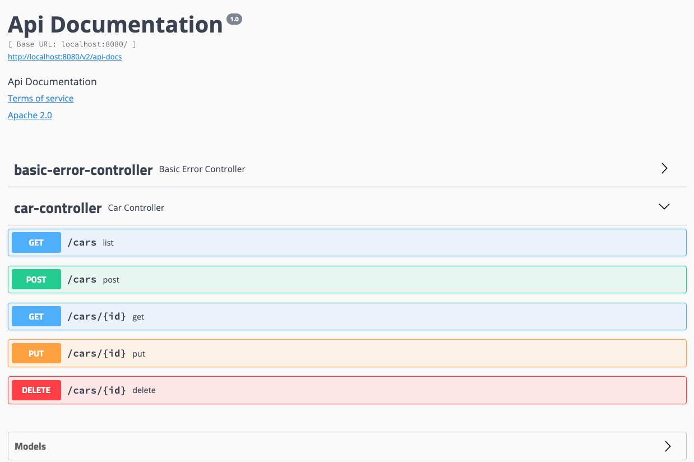

# Vehicles API

A REST API to maintain vehicle data and to provide a complete
view of vehicle details including price and address (obtained from the location and pricing services).

## Table of Contents
1. [Features](#features)
2. [How to turn this microservice into a Eureka client](#how-to-turn-this-microservice-into-a-eureka-client)
3. [Instructions](#instructions)
4. [Operations](#operations)
5. [Swagger Documentation](#swagger-documentation)
6. [Testing](#testing)
7. [Classes Explanations](#classes-explanations)
8. [H2 Database](#h2-database)

## Features

- REST API exploring the main HTTP verbs and features
- Hateoas
- Custom API Error handling using `ControllerAdvice`
- Swagger API docs
- HTTP WebClient
- MVC Test
- Automatic model mapping

## How to turn this microservice into a Eureka client: 
1. Ensure that both Eureka Discovery Client and Cloud Config dependencies are included: 
```
   <dependency>
        <groupId>org.springframework.cloud</groupId>
        <artifactId>spring-cloud-starter-netflix-eureka-client</artifactId>
    </dependency>
    <dependency>
        <groupId>org.springframework.cloud</groupId>
        <artifactId>spring-cloud-starter-config</artifactId>
    </dependency>
```

2. Add this dependency to dependency management:
```
    <dependencyManagement>
        <dependencies>
            <dependency>
                <groupId>org.springframework.cloud</groupId>
                <artifactId>spring-cloud-starter-parent</artifactId>
                <version>Greenwich.RELEASE</version>
                <type>pom</type>
                <scope>import</scope>
            </dependency>
        </dependencies>
    </dependencyManagement>
``` 

3. Add ```@EnableEurekaClient``` annotation in main Spring application class.

4. Configure name for this microservice application and server port **8082** and eureka client service url as:

```
# define name of microservice app:
spring.application.name=pricing-service
# port of this microservice server:
server.port=8082
# add Eureka Client service URL:
eureka.client.serviceUrl.defaultZone=http://localhost:8761/eureka/
eureka.client.service-url.default-zone=http://localhost:8761/eureka/

eureka.instance.prefer-ip-address=true
```

5. Ensure this microservice is registed with Eureka server by navigating to ```http://localhost:8761/```:


## Instructions

#### Udacity TODOs Requirements: 

- [x] Implement the `TODOs` within the `CarService.java` and `CarController.java`  files
- [x] Add additional tests to the `CarControllerTest.java` file based on the `TODOs`
- [x] Implement API documentation using Swagger

#### Run the Code

To properly run this application you need to start the Orders API and
the Service API first.


```$ mvn clean package```

```$ java -jar target/vehicles-api-0.0.1-SNAPSHOT.jar```

Import it in your favorite IDE as a Maven Project.

## Operations

Swagger UI: http://localhost:8080/swagger-ui.html

### Create a Vehicle

`POST` `/cars`
```json
{
   "condition":"USED",
   "details":{
      "body":"sedan",
      "model":"Impala",
      "manufacturer":{
         "code":101,
         "name":"Chevrolet"
      },
      "numberOfDoors":4,
      "fuelType":"Gasoline",
      "engine":"3.6L V6",
      "mileage":32280,
      "modelYear":2018,
      "productionYear":2018,
      "externalColor":"white"
   },
   "location":{
      "lat":40.73061,
      "lon":-73.935242
   }
}
```

### Retrieve a Vehicle

`GET` `/cars/{id}`

This feature retrieves the Vehicle data from the database
and access the Pricing Service and Boogle Maps to enrich 
the Vehicle information to be presented

### Update a Vehicle

`PUT` `/cars/{id}`

```json
{
   "condition":"USED",
   "details":{
      "body":"sedan",
      "model":"Impala",
      "manufacturer":{
         "code":101,
         "name":"Chevrolet"
      },
      "numberOfDoors":4,
      "fuelType":"Gasoline",
      "engine":"3.6L V6",
      "mileage":32280,
      "modelYear":2018,
      "productionYear":2018,
      "externalColor":"white"
   },
   "location":{
      "lat":40.73061,
      "lon":-73.935242
   }
}
```

### Delete a Vehicle

`DELETE` `/cars/{id}`

## Swagger Documentation

### Setup: 
1. In ```pom.xml``` file, add Swagger UI and Swagger 2 dependencies:
```
<dependency>
    <groupId>io.springfox</groupId>
    <artifactId>springfox-swagger-ui</artifactId>
    <version>2.9.2</version>
</dependency>

<dependency>
    <groupId>io.springfox</groupId>
    <artifactId>springfox-swagger2</artifactId>
    <version>2.9.2</version>
    <scope>compile</scope>
</dependency>
```
2. Make a new folder called ```config``` with a new class called ```SwaggerConfig.java```

3. Integrate Swagger into existing spring boot project using Docket bean with custom information using ApiInfo by adding: 
```
@Bean
public Docket api() {
   return new Docket(DocumentationType.SWAGGER_2)
         .select()
         .apis(RequestHandlerSelectors.any())
         .paths(PathSelectors.any())
         .build()
         .useDefaultResponseMessages(false); 
}

private ApiInfo apiInfo() {
  return new ApiInfo(
        "Vehicles API",
        "This API contains information about vehicles with price and location.",
        "1.0",
        "http://localhost/8080/cars",
        new Contact("Phuong Tran", "www.example.com", "myeaddress@company.com"),
        "License of API", "API license URL", Collections.emptyList());
  }
```
**Reference:** https://www.baeldung.com/swagger-2-documentation-for-spring-rest-api

4. Navigate to: ```localhost:8080/swagger-ui.html```. This window should appear on the browser: 

   
5. In ```CarController.java class```, add custom response messages for status code of 400, 401, 500 by using @ApiResponses and @ApiResponse: 
```
@ApiResponses(value = {
   @ApiResponse(code=400, message="This is a bad request. Please follow the API documentation for proper request."),
   @ApiResponse(code=401, message="Due to security constraints, your access request cannot be authorized."),
   @ApiResponse(code=500, message="The server is down. Please make sure that the Price and Maps microservices are running.")
})
```

## Testing: 
Testing gives you a confidence that your application is working when you make changes. First, unit test your small piece, then integrate your piece with the other system components to conduct integration testing.
By adding Spring Boot Starter Test into ```pom.xml```, we will import both Spring Boot Test modules as well as JUnit, AssertJ, Hamcrest, etc. 
```
<dependency>
  <groupId>org.springframework.boot</groupId>
  <artifactId>spring-boot-starter-test</artifactId>
  <scope>test</scope>
</dependency>
```

### Unit Testing REST APIs using JUnit, Mockito, Spring Test (or MockMVC): 

* **JUnit:** popular unit <u>testing framework</u> that allows you to test individual units of source code. 
* **Mockito:** a <u>mocking framework</u> which <u>provides data</u> for JUnit tests. 
* **@MockBean:** works with Mockito library to <u>mock the dependent beans</u> like the <u>Service layer bean</u>
* **@WebMvcTest:** an annotation used for <u>Controller layer</u> unit testing, often 1 controller at a time
* **@Test** indicates a method is for <u>Unit Test</u>

### Integration Testing: 
**@SpringBootTest:**
- indicates an <u>Integration Test</u> as it starts the full application contexts.
- including the server and does not customize component scanning. 
- look for main configuration class starting with @SpringBootApplication
- 
**@SpringBootTest(webEnvironment = SpringBootTest.WebEnvironment.RANDOM_PORT)**: 
- starts the server with a random port to avoid conflicts in a test environment.

**@AutoConfigureMockMvc:**
- inject Spring Mock MVC (or Spring Test)
- simulates calling the code from the client the same as processing a real HTTP request

**Mockito.verify()**: 
- used to test the number of times the <u>Mock method</u> has been called using **Mockito**
- In this project, the Car Service has been mocked once (1 times), and the method inside the Service (such as list()) has been called. 

## Classes Explanations: 

### ```vehicles```

### VehiclesApiApplication
This launches the Vehicles API as a Spring Boot application. Additionally, it initializes a few car manufacturers to place in the ManufacturerRepository, as well as creating the 
web clients to connect to the Maps and Pricing services.

### ```vehicles.api```

### API Error
Declares a few quick methods to return errors and other messages from the Vehicles API.

### CarController
This is our actual REST controller for the application. This implements what happens when GET, POST, PUT and DELETE requests are received (using methods in the CarService), and how they are responded to (including formatting with CarResourceAssembler). You will implement these methods in your code.

### CarResourceAssembler
This helps mapping the CarController to the Car class to help return the API response.

### ErrorController
This helps to handle any invalid arguments fed to the API.

### ```vehicles.client.maps```

### Address
Very similar to the Address file for boogle-maps, this declares a class for use with the MapsClient.

### MapsClient
Handles the format of a GET request to the boogle-maps WebClient to get location data.

### ```vehicles.client.prices```

### Price
Very similar to the Price file for pricing-service, this declares a class for use with the PriceClient.

### PriceClient
Handles the format of a GET request to the pricing-service WebClient to get pricing data.

### ```vehicles.domain```

### Condition
This enumerates the available values for the condition of a car (New or Used).

### Location
This declares information about the location of a vehicle. This is not the exact same as the Address class used by boogle-maps - it's primary use is related to the storage of latitude and longitude values. Because the data, such as address, gathered from boogle-maps is annotated as @Transient, this data is not stored until the next time boogle-maps is called.

### ```vehicles.domain.car```

### Car
This declares certain information about a given vehicle, mostly that more about the car entry itself (such as CreatedAt). Note that a separate class, Details, also stores additional details about the car that is more specific to things like make, color and model. Note that similar to Location with data like address, this uses a @Transient tag with price, meaning the Pricing Service must be called each time a price is desired.

### CarRepository
This repository provide a type of data persistence while the web service runs, primarily related to vehicle information received in the CarService.

### Details
Declares additional vehicle details, primarily about the car build itself, such as fuelType and mileage.

### ```vehicles.domain.manufacturer```

### Manufacturer
This declares the Manufacturer class, primarily just made of a ID code and name of manufacturer.

### ManufacturerRepository
This repository provides a type of data persistence while the web service runs, primarily to store manufacturer information like that initialized in VehiclesApiApplication.

### ```vehicles.domain```

### CarNotFoundException
This creates a CarNotFoundException that can be thrown when an issue arises in the CarService

### CarService
The Car Service does a lot of the legwork of the code. It can gather either the entire list of vehicles or just a single vehicle by ID (including calls to the maps and pricing web clients). It can also save updated vehicle information. Lastly, it can delete an existing car. All of these are called by the CarController based on queries to the REST API. You will implement most of these methods yourself.

### ```test/../vehicles.api```

### CarControllerTest
Here, the various methods performed by the CarController are performed by creating mock calls to the Vehicles API. You will implement some of these methods yourself for great practice in building your own tests.

## H2 Database: 

Navigate to H2 Database at ```localhost:8080/h2``` as below, and click ```Connect```: 
